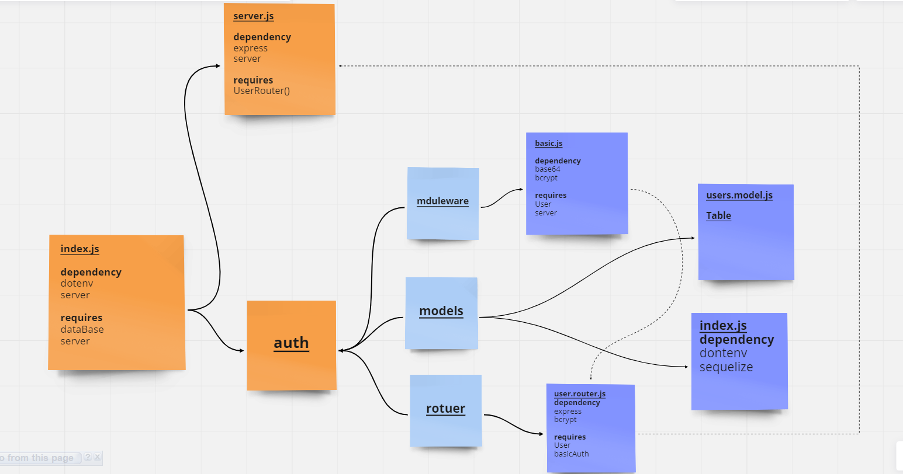

# basic-auth

**The packages needed in the task**
* npm init -y
* npm i express dotenv sequelize pg base-64 bcrypt
### URL
---
[Heroku](https://mohammad-basic-auth.herokuapp.com/)

[Pull Request](https://github.com/Mohammad-Alhaj/basic-auth/pulls)

[Actions](https://github.com/Mohammad-Alhaj/basic-auth/actions/new)

---
### UML

